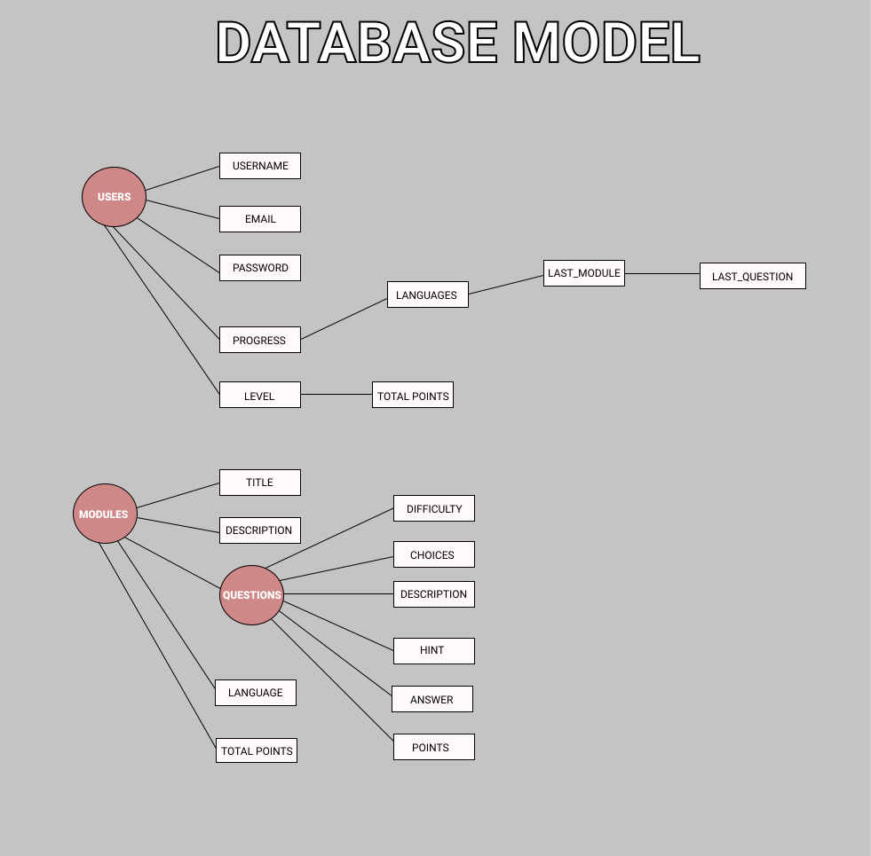

# CodeLoco

## Table of Contents
1. [Overview](#Overview)
1. [Product Spec](#Product-Spec)
1. [Wireframes](#Wireframes)
2. [Schema](#Schema)

## Overview
### Description
"CodeLoco" aims to help those interested in coding learn fundamentals that all high level coding languages adhere to (OOP, Data Structures, Searching Algorithms). Expanding on these ideas for real world applications that can make coding fun and interactive for the user. (early implementation will focus on multiple choice checks on user knowledge, while later implementation could encourage users to write their own code and have it compiled and tested in app) The end goal of this app is for users to feel confident in these larger coding topics and have the tools to apply them in later projects. Could extend further into learning git for project management, working with frameworks that support web dev, and project ideas to help other people get started with basic implementation of web based apps.

### App Evaluation
[Evaluation of your app across the following attributes]
- Education
- **Mobile:** ? dont know what is meant by Mobile Story and Habit
- **Story:** ?
- Students in Comp Sci or just anyone interested in comp sci
- **Habit:** ?
- coding basics, intro to cross language concepts and some language specifics

## Product Spec

### 1. User Stories (Required and Optional)

**Required Must-have Stories**

- [x] User logins/memory (remember where they left off)
- [ ] Main tab containing different modules of focus (introduction to coding basics, language specifics, OOP basics, big O, Sorting algos)
- [ ] Each module has separate lessons to build up understanding (new screen once clicked)
- [ ] Aiming for at least 3-4 modules, want each module to contain at least ~ (an hour) of content
- [ ] Multiple choice quick checks on concepts addressed in lesson
- [x] Profile tab shows progress to this point (level up maybe?), account age, adjust account credentials
- [x] Profile settings to change picture, username and password.
- [x] User can login, logout and stay logged in across restarts.

**Optional Nice-to-have Stories**

- [ ] Hackerrank-esque challenges
- [ ] Achievements
- [ ] Graphics/animations (made by us for more specifics)
- [ ] Settings in profile for different display modes dark mode, text size, etc.
- [ ] Friends tab *much later if anything for helping grow userbase*

### 2. Screen Archetypes

* Learn tab
   * modules in reusable cell format 1 top 2 bottom basic buttons to indivdual modules
   * Scroll to further modules
* Module page
   * lessons display in resuable cell mode as well, progress bar, percent progress label, image view
   * click on cell to enter lesson
* Lesson page
   * custom made for each ideally, initial implementation could be cookie cutter, want to ensure lessons aren't so copy paste trash cause that won't help anyone really learn
   * include multiple choice checks that will add progress to Module page display
   * possibly challenges in page or as a lesson page of their own towards end of module page
* Profile page
   * User image, account age, email associated, user level, most recent 5-10 achievements with points for each 
   * edit profile button, settings button
* Settings page
   * Allow user to change display dark mode toggle, text size toggle, hide personal info toggle, etc.

### 3. Navigation

**Tab Navigation** (Tab to Screen)

* Learn
* Profile
* Store/Friends *would be extra*

**Flow Navigation** (Screen to Screen)
* Learn
   * Modules
    * Lessons
      * Lesson 
* Profile
   * Settings
   * Achievements - second page of more indepth search through achievements *optional at this time*

## Wireframes

### [BONUS] Digital Wireframes & Mockups
<iframe style="border: 1px solid rgba(0, 0, 0, 0.1);" width="800" height="450" src="https://www.figma.com/embed?embed_host=share&url=https%3A%2F%2Fwww.figma.com%2Ffile%2Fmh1GEgnwCGXEKJIT3YZ9Np%2FWireFrame%3Fnode-id%3D0%253A1" allowfullscreen></iframe>

## Schema 
### Models

#### Post

   | Property      | Type     | Description |
   | ------------- | -------- | ------------|
   | username      | String   | username of the user - used to login |
   | email         | String   | email of the user - used to login |
   | password      | String   | password of the user - used to login |
   | progress      | Dictionary | dictionary that contains module progress of the user in each programming language, includes languges, last module question keys |
   | level         | Number   | numeric level of the user that is based on total points |
   | totalPoints   | Number   | numeric value of points gained by completeting modules |
   | title         | String   | title of a module of a certain programming language |
   | description   | String   | description of a module of a certain programming language |
   | language      | String   | type of language of a module |
   | points        | Number   | numeric value of points a module can give |
   | Questions     | Dictionary | dictionary that holds all questions for a module, includes difficulty, choices, description, hint, answer, and points keys |
   | createdAt     | DateTime | date when post is created (default field) |
   | updatedAt     | DateTime | date when post is last updated (default field) |
   
### Networking
#### List of network requests by screen
**Login page** 
- Login - [Post] - Auth, post username/email and password
- Sign Up - [Post] - Auth - post username, email and password

**Modules page**
- Display modules - [Get] - Get all modules in an array

**Profile page**
- Display profile - [Get] - Get username, level and total points
- Edit profile - [Post] - Post edited username, email or password

**Achievements page**
- Display Achievements - [Get] - Get progress, level and total points

**Available Lessons page**
- Display Lessons/progress - [Get] - Get specific module, title, and description

**Lesson page**
- Display Lesson - [Get] - Get specific questions with title and choices
- Send answer - [Post] - Post answer to questions
- Confirm answer - [Get] Send and confirm probably both be covered by post
